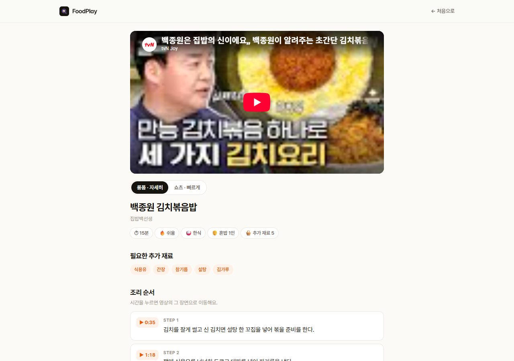
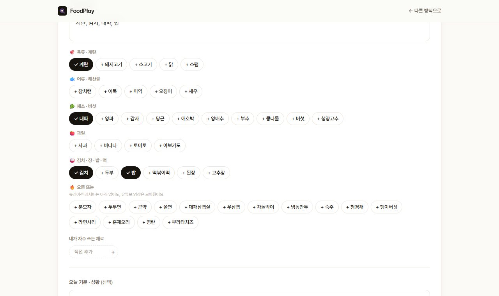
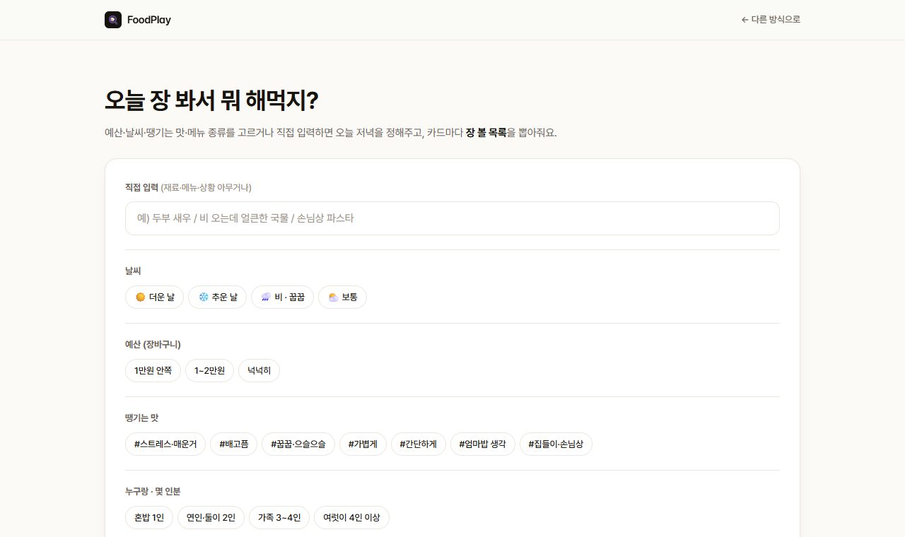
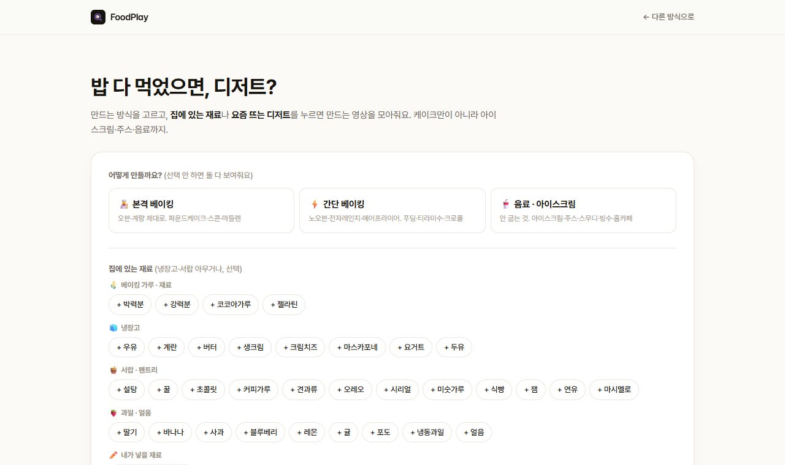

# FoodPlay

냉장고에 있는 재료를 넣으면 만들 수 있는 **유튜브 요리 영상**을 찾아주고,
조리 스텝의 **타임스탬프를 누르면 영상의 그 장면으로 바로 넘어가는** 웹·모바일 앱입니다.

- **데모** https://diwony.github.io/FoodPlay/ · **역할** 1인 (기획 / 프론트엔드 / 데이터 파이프라인)
- **스택** Vite·React 19·Tailwind v4 (웹) / Expo·React Native 0.86 (앱) / Cloudflare Workers·KV / YouTube Data API v3 / Claude API(빌드 타임)
- **규모** 코드 ~7.3k줄 · 큐레이션 레시피 25 · 유튜브 영상 풀 11,200+

---

## 왜 만들었나

요리 영상을 틀어놓고 밥을 해본 사람이라면 겪는 불편이 있습니다. 저는 이걸 세 가지로 정리했습니다.

- **냉장고엔 재료가 있는데 뭘 할지 모른다.** 유튜브 검색은 요리 이름을 알아야 씁니다.
  "김치·계란·대파로 뭐 만들지"는 검색이 안 됩니다.
- **영상의 어느 구간을 봐야 할지 모른다.** 15분짜리 영상에서 지금 내가 하는 단계가 몇 분에
  있는지 찾느라 재생 바를 앞뒤로 긁습니다.
- **손이 젖어서 폰을 못 만진다.** 스크롤해서 레시피 글을 읽는 순간 영상은 화면 밖으로 사라집니다.

레시피 앱은 깔끔한 텍스트를 주지만 "이 사람이 실제로 어떻게 하는지"를 못 보여주고, 유튜브는
영상은 좋은데 위 세 가지를 안 풀어줍니다. **재료로 찾고, 영상의 바로 그 장면으로 가고, 요리하는
내내 영상이 계속 보이게** — 이 세 가지를 한 화면에서 이어주는 게 FoodPlay의 목표입니다.



## 서비스를 어떻게 설계했나

**시작점을 상황별로 나눴습니다.** 냉장고를 털 때, 산 밀키트에 뭘 더할 때, 장을 보러 나갈 때,
디저트를 만들 때 — 머릿속에 있는 정보도, 원하는 결과도 전부 다릅니다. 검색창 하나로 다 받으면
아무것도 제대로 못 받습니다. 그래서 진입점을 4개 모드로 나누고, 각 모드는 그 상황에 필요한
것만 묻습니다. (장보기는 예산·날씨를, 디저트는 오븐 유무를)

**재료가 없어도 시작할 수 있게 했습니다.** "오늘 비 와서 뜨끈한 거"만 골라도 추천이 나옵니다.
재료를 하나하나 입력하는 건 생각보다 귀찮고, 그 마찰 때문에 사람들은 앱을 안 엽니다. 칩으로
고르거나 문장으로 써도 되고("스트레스 받아서 매운 거"), 목록에 없는 재료는 직접 추가해 기기에
저장합니다.

**영상을 화면에 "고정"했습니다.** 조리 스텝을 읽으려고 스크롤하면 영상이 우상단으로 줄어들어
계속 재생됩니다. 스텝의 시간을 누르면 그 장면으로 점프합니다. 요리 중엔 폰을 자주 못 만지니까,
한 번의 탭으로 "그 장면 + 그 설명"에 닿게 하는 게 핵심이었습니다.

**"이거 진짜 될까"에 답하려고 했습니다.** 레시피를 고를 때 가장 불안한 건 실패입니다. 그래서
그 영상 댓글에서 "간 조절만 주의하면 성공" 같은 실사용 후기를 뽑아 카드에 붙이고, 계량을
정확히 보고 싶은 사람을 위해 블로그 레시피도 영상과 별개로 추천합니다.

**숙련도에 따라 밀도를 고르게 했습니다.** 처음 하는 요리는 자세한 롱폼(타임스탬프), 몇 번 해본
요리는 30초 숏폼. 같은 요리라도 원하는 정보량이 다릅니다. 카드마다 난이도·조리 시간·인분
(혼밥/둘이/가족)을 함께 보여주는 것도 같은 이유입니다.

| | | |
|---|---|---|
|  |  |  |

---

## 기술 선택과 구현

구현하면서 방향을 잡아준 원칙은 **"화면을 열 때마다 밖에 나가지 않는다"** 였습니다. 레시피
데이터는 빌드 타임에 미리 만들고, 실시간 호출은 옵션으로만 두되 실패해도 화면이 비지 않게
폴백을 기본값으로 뒀습니다.

```
[입력] 사람이 고른 영상 + 자막 + 댓글
   └─▶ build.mjs · Claude(claude-sonnet-5)   자막→스텝·타임스탬프 / 재료 / vibe / 댓글 요약
        └─▶ validate.mjs   스키마 + 타임스탬프 단조 증가 검증
             └─▶ recipes.json (정적, 커밋)   ← 웹·앱은 완성된 이 JSON만 읽음
```

**사람이 좋은 영상을 고르고, Claude는 자막에서 스텝·재료를 뽑아내는 반복 작업을** 맡습니다.
웹·앱은 완성된 JSON만 읽고, 매칭·랭킹·파싱 로직은 의존성 0인 순수 패키지(`@foodplay/core`)로
떼어내 웹(IFrame API)·앱(RN)이 UI만 각자 만들고 나머지는 그대로 공유합니다. 영상 제어도
`seekTo`·`pause`라는 같은 계약으로 맞췄습니다.

```
2층 · 실시간(옵션)   Cloudflare Workers 프록시가 키를 시크릿으로 감춘 채 대신 호출
                    Data API v3 → KV 24h 캐시 → IP당 rate limit → 실패 시 200+빈 배열
        │  실시간 결과에는 "실시간" 배지를 달아 위에 얹고, 실패하면 아래 폴백만 남음
        ▼
1층 · 정적 풀(항상)   youtube-pool.json · 영상 11,200+개
                    빌드 타임에 공식 API로 모으고, 진행 위치를 저장해 매일 이어받다가 403이면 멈춤
```

### 특히 고민했던 부분

**스크롤해도 끊기지 않는 미니 플레이어** (`useMiniPlayer.ts`)
영상을 다른 컨테이너로 옮기면 iframe이 다시 로드되면서 재생이 끊깁니다. 그래서 iframe 노드는
한 번 붙인 뒤 **옮기지도 다시 만들지도 않습니다.** 스크롤 리스너는 슬롯 위치만 읽어 **같은
노드의 CSS 클래스만** 바꾸고, 레이아웃 전(크기 0)에는 판단을 미뤄 초기 깜빡임까지 없앴습니다.

**정적 사이트에서 API 키 감추기** (`workers/youtube-search`)
GitHub Pages 배포라 클라이언트에 YouTube 키를 둘 수 없었습니다. Workers 프록시가 키를
시크릿으로 들고 대신 호출하고, 그 위에 KV 24h 캐시(할당량 절약) · IP당 rate limit · CORS
화이트리스트 · 오류 응답 `no-store`를 겹쳤습니다. 모든 실패는 빈 배열로 흡수해 호출하는 쪽은
폴백만 신경 쓰면 됩니다.

**한 채널이 목록 상단을 독식하는 문제** (`match.ts`)
조회수로 정렬하니 백종원 영상이 상위를 거의 다 차지했습니다. 점수순 배열을 다시 훑으며 같은
채널이 반복될 때마다 커지는 감점(회당 0.12)을 주고 그리디하게 다시 골랐습니다. 점수 차가 크면
순서를 그대로 두고, **비슷한 후보들 사이에서만** 채널을 번갈아 줍니다.

**자유롭게 쓴 문장을 필터로** (`vibes.ts`)
"비 와서 으슬으슬해" 같은 입력도 결과에 반영하고 싶었습니다. vibe별 키워드 사전으로 부분
매칭합니다. 재료가 1순위이고 vibe는 **하드 필터가 아니라 정렬 가중치**라, 키워드를 잘못
잡아도 결과가 사라지지는 않습니다.

---

실행 `npm run dev --prefix apps/web` · 파이프라인 `node pipeline/build.mjs`
All Rights Reserved (포트폴리오 열람용) · gjiwon566@gmail.com
